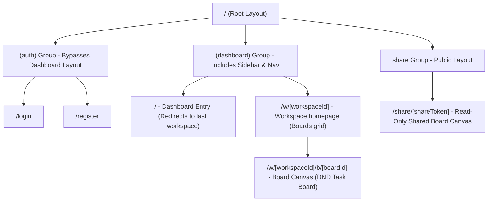
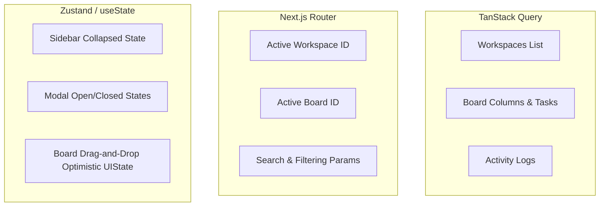
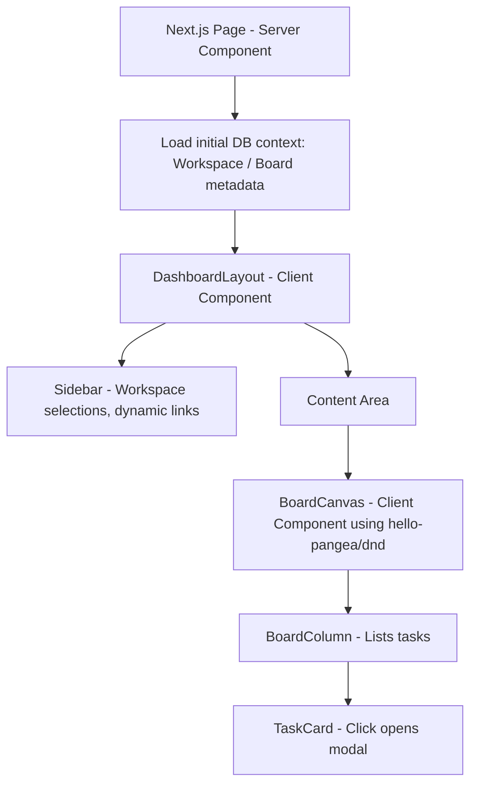
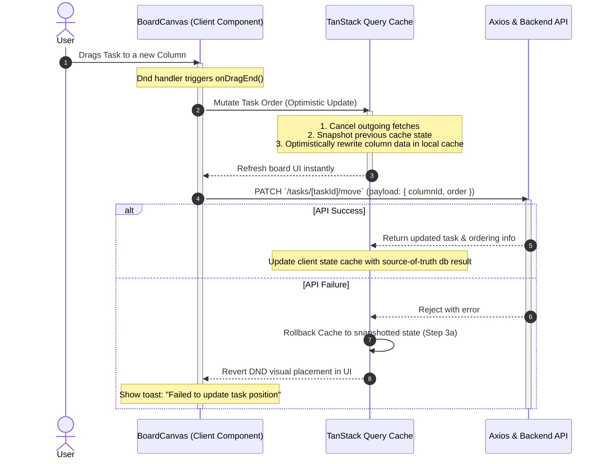

# Frontend Architecture Design Document

This document outlines the architecture for the **SaaS Task Management Platform** built using Next.js 15 App Router, TypeScript, Zustand, TanStack Query, Axios, Shadcn UI, and `@hello-pangea/dnd`. 

The architecture is designed to be **highly maintainable, scalable, and pragmatic**—striking the right balance for a 1-2 day take-home assignment without introducing unnecessary abstractions or over-engineering.

---

## 1. Production-Quality Folder Structure

We adopt a **hybrid feature-based structure**. Core shared code (UI library, base configurations, utilities) lives in the root directory, while business logic (API requests, hooks, state, sub-components) is encapsulated within modular features. This keeps the project easy to navigate and test.

```text
src/
├── app/                        # Next.js App Router (Routing and Pages only)
│   ├── (auth)/                 # Route Group for auth flows
│   │   ├── login/
│   │   └── register/
│   ├── (dashboard)/            # Route Group for authenticated app dashboard
│   │   ├── layout.tsx          # Workspace sidebar & navbar layout
│   │   ├── page.tsx            # Redirection / onboarding landing
│   │   └── w/                  # Workspaces parent route
│   │       └── [workspaceId]/
│   │           ├── page.tsx    # Workspace dashboard (boards list)
│   │           └── b/          # Boards sub-route
│   │               └── [boardId]/
│   │                   └── page.tsx # Board view (drag-and-drop workspace)
│   ├── share/                  # Public read-only board page
│   │   └── [shareToken]/
│   │       └── page.tsx
│   ├── layout.tsx              # Root HTML and metadata layout
│   └── providers.tsx           # QueryClient, Zustand, Theme, and Toast providers
│
├── components/                 # Global Shared Components
│   ├── ui/                     # Shadcn components (atomic, un-modified)
│   └── shared/                 # Shell elements (e.g., Sidebar, UserAvatar, ModalProvider)
│
├── features/                   # Encapsulated Domain Logic
│   ├── auth/
│   │   ├── api/                # Auth mutations (login, register, logout)
│   │   ├── components/         # AuthCard, LoginForm, RegisterForm
│   │   ├── hooks/              # useCurrentUser hook
│   │   └── types/              # Auth-specific types
│   ├── workspaces/
│   │   ├── api/                # useGetWorkspaces, useCreateWorkspace queries
│   │   ├── components/         # WorkspaceSelector, WorkspaceSettings
│   │   └── hooks/              # useCurrentWorkspace parsing utilities
│   ├── boards/
│   │   ├── api/                # useGetBoard, useCreateBoard, useUpdateBoard
│   │   ├── components/         # BoardCanvas, ColumnContainer, BoardHeader
│   │   ├── hooks/              # Board DND interaction logic
│   │   └── store/              # Zustand store for board UI state (filters, zoom)
│   ├── tasks/
│   │   ├── api/                # useCreateTask, useUpdateTask, useDeleteTask
│   │   └── components/         # TaskCard, TaskDetailModal, TaskForm
│   └── activity-feed/
│       ├── api/                # useGetActivityFeed
│       └── components/         # ActivityFeedList, ActivityLogItem
│
├── lib/                        # Cross-cutting configurations
│   ├── api-client.ts           # Axios client instance & interceptors
│   ├── query-client.ts         # TanStack Query Client configuration
│   └── utils.ts                # cn utility for Tailwind classes
│
├── types/                      # Shared core domain types
│   └── index.ts                # Workspace, Board, Column, Task types
```

---

## 2. Routing Structure

Next.js 15 App Router is leveraged to split private workspace spaces, guest views, and authentication screens.



### Route Definitons & Middleware Strategy
1. **Route Groups**: We use `(auth)` and `(dashboard)` to isolate layout structures. The dashboard layout houses the sidebar list of workspaces, current user context, and theme toggles.
2. **Dynamic Contexts**: The workspace and board contexts are derived directly from the URL params (`[workspaceId]`, `[boardId]`). This eliminates the need to synchronize active IDs with global client state.
3. **Middleware (`middleware.ts`)**:
   - Intercepts requests to check for an authentication cookie (JWT / Session token).
   - Redirects unauthenticated users attempting to access `(dashboard)/*` to `/login`.
   - Redirects authenticated users attempting to access `/login` or `/register` to the dashboard root `/`.
   - Allows public `/share/*` pages to bypass authentication completely.

---

## 3. State Management Architecture

A major pitfall in SaaS client-side apps is **caching state in global stores** when it should be managed as **server state** or **URL state**. We use a strict division of labor:



### State Categorization Table

| State Type | Technology | Used For | Rationale |
| :--- | :--- | :--- | :--- |
| **Server State** | **TanStack Query** | Active Board, Columns, Tasks, User, Workspaces, Activity Feed. | Automates caching, background revalidation, loading states, and optimistic updates. |
| **URL State** | **Next.js URL Params & Query Params** | Active workspace ID (`/w/[workspaceId]`), active board ID (`/b/[boardId]`), search term (`?q=task`), tag filters (`?tags=bug`). | Allows deep-linking, supports page refreshes, respects browser history back/forward buttons, and is parsed cleanly on the server. |
| **Global Client State** | **Zustand** | Task details modal open/close, workspace creator modal, sidebar collapsed state. | Extremely lightweight, boilerplate-free state store. Used only for values that need to be accessed globally across UI boundaries but do not belong in the URL. |
| **Local Component State** | **React `useState`** | Dropdown toggle, hover indices, input states, temporary drag offsets. | Self-contained, simple components that don't leak logic to the rest of the application. |

---

## 4. API Layer Architecture

Our API layer uses a centralized Axios client integrated with TanStack Query. All requests live in feature-specific subdirectories under `features/[name]/api/`.

### Custom Axios Client (`src/lib/api-client.ts`)
```typescript
import axios from "axios";

export const apiClient = axios.create({
  baseURL: process.env.NEXT_PUBLIC_API_URL || "/api",
  timeout: 10000,
  headers: {
    "Content-Type": "application/json",
  },
  withCredentials: true, // Enables cookies for authentication
});

// Interceptor for appending Auth Headers if not using Cookies
apiClient.interceptors.request.use((config) => {
  const token = typeof window !== "undefined" ? localStorage.getItem("token") : null;
  if (token && config.headers) {
    config.headers.Authorization = `Bearer ${token}`;
  }
  return config;
});

// Interceptor for standardized error handling
apiClient.interceptors.response.use(
  (response) => response.data, // Strip Axios wrapper, return payload
  (error) => {
    const message = error.response?.data?.message || "An unexpected error occurred.";
    // Toast warning or Sentry trigger
    return Promise.reject(new Error(message));
  }
);
```

### Feature-Specific Query Hook example (`src/features/boards/api/use-update-board.ts`)
Instead of calling API functions inside component controllers, we wrap them in custom hooks.
```typescript
import { useMutation, useQueryClient } from "@tanstack/react-query";
import { apiClient } from "@/lib/api-client";
import { Board } from "@/types";

interface UpdateBoardPayload {
  boardId: string;
  name?: string;
  isPublic?: boolean;
}

export const useUpdateBoard = () => {
  const queryClient = useQueryClient();

  return useMutation({
    mutationFn: async ({ boardId, ...payload }: UpdateBoardPayload) => {
      return apiClient.patch<any, Board>(`/boards/${boardId}`, payload);
    },
    onSuccess: (data) => {
      // Invalidate the cache for this specific board
      queryClient.invalidateQueries({ queryKey: ["board", data.id] });
      // Invalidate list of boards for dashboard layout
      queryClient.invalidateQueries({ queryKey: ["boards", data.workspaceId] });
    },
  });
};
```

---

## 5. Type Definitions Architecture

Domain models are declared in a central `types/index.ts` file. This acts as the single source of truth for database schemas, while payload request/response types are declared in feature-specific locations.

### Shared Domain Types (`src/types/index.ts`)
```typescript
export interface User {
  id: string;
  name: string;
  email: string;
  avatarUrl?: string;
}

export interface Workspace {
  id: string;
  name: string;
  slug: string;
  ownerId: string;
  createdAt: string;
}

export interface Board {
  id: string;
  workspaceId: string;
  name: string;
  isPublic: boolean;
  shareToken?: string;
  createdAt: string;
}

export interface Column {
  id: string;
  boardId: string;
  title: string;
  order: number; // For sorting in the board layout
}

export interface Task {
  id: string;
  columnId: string;
  title: string;
  description?: string;
  order: number; // For sorting
  assignees: User[];
  dueDate?: string;
  priority: "LOW" | "MEDIUM" | "HIGH";
  createdAt: string;
}

export interface ActivityLog {
  id: string;
  workspaceId: string;
  userId: string;
  user: User;
  action: "CREATE" | "UPDATE" | "DELETE" | "MOVE";
  entityType: "BOARD" | "COLUMN" | "TASK";
  entityName: string;
  createdAt: string;
}
```

---

## 6. Component Organization Strategy

Next.js 15 App Router encourages server components by default. Our strategy uses Server Components as **Context Providers & Data Loaders** and Client Components as **Interactive UI Panels**.



### Component Rules
1. **Atomic Components (`components/ui`)**:
   - Sourced from Shadcn UI (`button.tsx`, `dialog.tsx`, `dropdown-menu.tsx`).
   - Placed in standard directories. Custom styling changes are applied only via Tailwind utilities; code logic remains untouched.
2. **Feature Components (`features/[feature]/components`)**:
   - Reusable components bound to specific domains. Examples: `BoardCanvas` lives in `features/boards/components/`, `TaskCard` lives in `features/tasks/components/`.
   - Never imported directly into other features unless explicit dependencies are established (e.g., `BoardCanvas` importing `TaskCard` is fine, but `auth` components must not import `task` components).
3. **Modal Pattern**:
   - Instead of nested modals everywhere which cause state synchronization bugs, we use a single centralized mounting system.
   - We use global Zustand state to open specific modals, and mount them once inside a global `ModalProvider` in the root `layout.tsx`. This avoids layout shift bugs and ensures clean overlay rendering.

---

## 7. Data Flow Diagram

The drag-and-drop mechanism represents the most complex interaction on a Kanban board. Here is how state and modifications flow between `@hello-pangea/dnd`, Zustand (for visual snap), TanStack Query (for local cache update), and the Backend API.



---

## 8. Trade-Offs & Architectural Decisions

### A. Dynamic URL State vs. State Store Contexts
- **Decision**: Keep the active Workspace ID and Board ID in the URL structure rather than a global Zustand store.
- **Trade-Off**: 
  - *Pros*: Users can bookmark workspace/board links. Refreshing the browser doesn't wipe the workspace context. Deep-linking works seamlessly out-of-the-box. Next.js server components can read IDs from routing parameters and pre-fetch queries.
  - *Cons*: Components that are deep in the DOM tree must either retrieve the IDs using `useParams()` or have properties passed down.
  - *Resolution*: Utilizing React hooks like `useParams()` makes accessing URL states trivial, rendering this choice highly favorable.

### B. Hybrid Feature Folders vs. Modular Clean Architecture
- **Decision**: Standardize on `features/` folders instead of separating elements into strictly flat folders (e.g. all hooks in `/hooks`, all pages in `/pages`, all queries in `/queries`).
- **Trade-Off**:
  - *Pros*: Excellent scalability. When refactoring the "Tasks" module, all related forms, schemas, queries, and buttons are co-located in a single directory. A developer does not have to jump between 6 root directories to make a change.
  - *Cons*: Small cognitive overhead when starting.
  - *Resolution*: Critical for maintainability and reduces clutter in large assignments.

### C. Client-Side DND with Optimistic Updates vs. Server Action Locks
- **Decision**: Manage dragging tasks with TanStack Query mutations and optimistic updates, rather than Next.js Server Actions with immediate page refetches.
- **Trade-Off**:
  - *Pros*: Zero lag UI. The card drops instantly. If the network call fails, it rolls back gracefully. This is essential for a fluid SaaS user experience.
  - *Cons*: Implementation requires writing manual cache-manipulation logic inside TanStack Query `onMutate` and `onError` blocks.
  - *Resolution*: Essential for modern SaaS apps. An app where cards block or stutter for 400ms while loading a Server Action response feels amateurish.

### D. Session Cookie Auth vs. Local Storage JWT
- **Decision**: Use HttpOnly cookies containing a JWT session token.
- **Trade-Off**:
  - *Pros*: Shields the client from XSS-based token theft. Middleware can read cookies on the server side instantly, preventing flashes of unauthenticated content during dashboard loads.
  - *Cons*: Requires setting up CORS credentials (`withCredentials: true`) and cookie handling on the backend.
  - *Resolution*: Standard security practice that separates a professional take-home assignment from a basic prototype.
